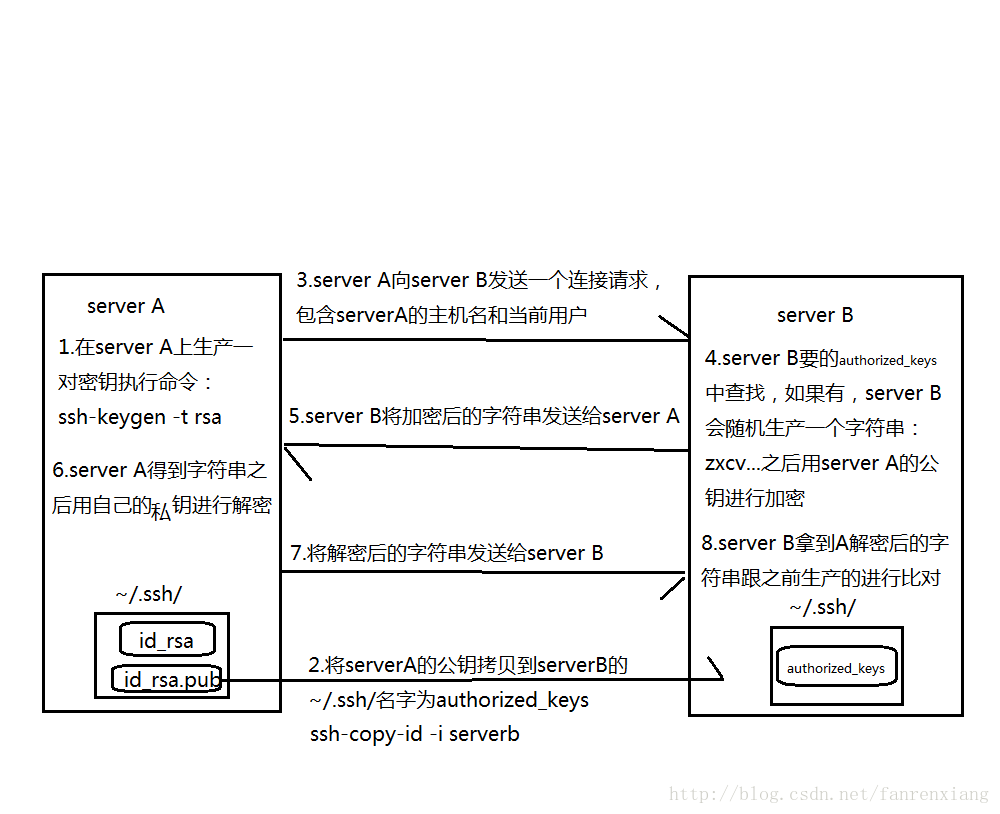

# BigData

<!-- @import "[TOC]" {cmd="toc" depthFrom=1 depthTo=6 orderedList=false} -->

<!-- code_chunk_output -->

- [BigData](#bigdata)
  - [参考文档](#参考文档)
  - [前期准备](#前期准备)
    - [查看/更改 hostname](#查看更改-hostname)
    - [做 IP 和主机名的映射](#做-ip-和主机名的映射)
    - [关闭防火墙](#关闭防火墙)
    - [时间设置](#时间设置)
    - [SSH 免密登录（Hadoop 集群）](#ssh-免密登录hadoop-集群)
  - [hadoop 环境搭建](#hadoop-环境搭建)
    - [下载 jdk hadoop](#下载-jdk-hadoop)
    - [JDK 环境配置](#jdk-环境配置)
    - [Hadoop 环境配置](#hadoop-环境配置)
    - [新建文件夹](#新建文件夹)
    - [修改 Hadoop 配置文件](#修改-hadoop-配置文件)
    - [Hadoop 启动](#hadoop-启动)
  - [Hive](#hive)
    - [mysql 安装](#mysql-安装)
    - [下载 Hive](#下载-hive)
    - [环境变量](#环境变量)
    - [新建文件夹](#新建文件夹-1)
    - [修改配置](#修改配置)
    - [Hive 测试](#hive-测试)
  - [Spark](#spark)
    - [spark 下载](#spark-下载)
    - [环境变量](#环境变量-1)
    - [修改配置](#修改配置-1)
    - [测试](#测试)
    - [启动](#启动)
    - [Spark On Yarn](#spark-on-yarn)
  - [整合 spark hive](#整合-spark-hive)
    - [修改 hive-site.xml](#修改-hive-sitexml)
    - [重启 hive-metastore](#重启-hive-metastore)
    - [hive-site.xml 复制给 spark](#hive-sitexml-复制给-spark)
    - [复制 hive/lib 下的 mysql 驱动到 spark/jars](#复制-hivelib-下的-mysql-驱动到-sparkjars)
    - [spark-submit](#spark-submit)
  - [集群](#集群)
  - [安装 Scala](#安装-scala)
    - [下载 Scala](#下载-scala)
    - [配置环境变量](#配置环境变量)

<!-- /code_chunk_output -->

## 参考文档

[Hadoop 环境搭建(单机)](https://blog.csdn.net/qazwsxpcm/article/details/78637874)

[Hadoop+Hive 环境搭建图文详解(单机)](https://www.cnblogs.com/xuwujing/p/8045821.html)

## 前期准备

### 查看/更改 hostname

```shell
cat /etc/redhat-release

# 查看本机的名称
hostname
# 修改主机名称
hostnamectl set-hostname master
```

### 做 IP 和主机名的映射

```shell
vim /etc/hosts
```

添加内容

```
ip.ip.ip.ip master
```

### 关闭防火墙

```shell
systemctl stop firewalld.service
```

### 时间设置

单机可省略，集群 时间要一致

```shell
# 查看
date

# 设置时间
date -s 'yyyy-MM-dd HH:mm:ss'
```

### SSH 免密登录（Hadoop 集群）

```shell
#  下载
yum install openssh* -y
# 开机启用
systemctl enable sshd
# 测试
ssh localhost
```

```shell

ssh-keygen -t rsa

#  将指定的文件信息authorized_keys(注：文件名必须为authorized_keys)中，无改文件会自动创建
cat ~/.ssh/id_rsa.pub >> ~/.ssh/authorized_keys

# 直接将公钥拷贝到指定ip或主机中
ssh-copy-id -i  localhost
```

例如，我需要免密登录到 `192.168.1.129`，则

```shell
ssh-copy-id -i  192.168.1.129
```

此时我在 `localhost` 上连接操作 `192.168.1.129` 的服务器已经不需要输入密码



[SSH 参考链接](https://blog.csdn.net/fanrenxiang/article/details/69212647)

## hadoop 环境搭建

### 下载 jdk hadoop

[jdk-8u202-linux-x64.tar.gz](./jdk-8u202-linux-x64.tar.gz)

[hadoop-2.10.1.tar.gz](./hadoop-2.10.1.tar.gz)

1. 将下载下来的 jdk、hadoop 解压包放在 opt 目录下并新建 java、hadoop 文件夹

```shell
mkdir /opt/java && mkdir /opt/java/jdk1.8

mkdir /opt/hadoop && mkdir /opt/hadoop/hadoop2.10
```

2. 解压文件

```shell
# 解压jdk和hadoop ,分别移动文件到java和hadoop文件下，
# 并将文件夹重命名为jdk1.8和hadoop2.10
tar -xvf jdk-8u202-linux-x64.tar.gz
mv jdk1.8.0.202  /opt/java/jdk1.8

tar -xvf hadoop-2.10.1.tar.gz
mv hadoop-2.10.1  /opt/hadoop/hadoop2.10

```

### JDK 环境配置

```shell
vim /etc/profile
```

文件末尾添加

```profile
export JAVA_HOME=/opt/java/jdk1.8
export JRE_HOME=/opt/java/jdk1.8/jre
export CLASSPATH=.:$JAVA_HOME/lib/dt.jar:$JAVA_HOME/lib/tools.jar:$JRE_HOME/lib
export PATH=.:${JAVA_HOME}/bin:$PATH
```

启用配置

```shell
source /etc/profile
```

测试是否启用

```shell
java -version
```

### Hadoop 环境配置

配置步骤同 JDK

```profile
export HADOOP_HOME=/opt/hadoop/hadoop2.10
export HADOOP_COMMON_LIB_NATIVE_DIR=$HADOOP_HOME/lib/native
export HADOOP_OPTS="-Djava.library.path=$HADOOP_HOME/lib"
export PATH=.:${JAVA_HOME}/bin:${HADOOP_HOME}/bin:$PATH
```

### 新建文件夹

```shell
mkdir  /root/hadoop
mkdir  /root/hadoop/tmp
mkdir  /root/hadoop/var
mkdir  /root/hadoop/dfs
mkdir  /root/hadoop/dfs/name
mkdir  /root/hadoop/dfs/data
```

> 注:在 root 目录下新建文件夹是防止被莫名的删除。

### 修改 Hadoop 配置文件

```shell
cd /opt/hadoop/hadoop2.10/etc/hadoop/
```

1. core-site.xml

```shell
vim core-site.xml
```

```xml
<property>
    <name>hadoop.tmp.dir</name>
    <value>file:/root/hadoop/tmp</value>
    <description>Abase for other temporary directories.</description>
</property>

<property>
    <name>fs.default.name</name>
    <!-- master 是你的 hostname -->
    <value>hdfs://master:9000</value>
</property>

<!-- hive 连接时，不设置会报错 -->
<property>
    <name>hadoop.proxyuser.root.hosts</name>
    <value>*</value>
</property>
<property>
    <name>hadoop.proxyuser.root.groups</name>
    <value>*</value>
</property>
```

2. `hadoop-env.sh`

```shell
vim hadoop-env.sh
```

将${JAVA_HOME} 修改为自己的 JDK 路径

```sh
export   JAVA_HOME=${JAVA_HOME}
```

修改为：

```sh
export   JAVA_HOME=/opt/java/jdk1.8
```

3.  hdfs-site.xml

```shell
vim hdfs-site.xml
```

```xml
<property>
   <name>dfs.name.dir</name>
   <value>file:/root/hadoop/dfs/name</value>
   <description>Path on the local filesystem where theNameNode stores the namespace and transactions logs persistently.</description>
</property>
<property>
   <name>dfs.data.dir</name>
   <value>file:/root/hadoop/dfs/data</value>
   <description>Comma separated list of paths on the localfilesystem of a DataNode where it should store its blocks.</description>
</property>
<property>
  <name>dfs.replication</name>
  <value>1</value>
</property>
<property>
  <name>dfs.permissions</name>
  <value>false</value>
  <description>need not permissions</description>
</property>

```

> 说明：dfs.permissions 配置为 false 后，可以允许不要检查权限就生成 dfs 上的文件，方便倒是方便了，但是你需要防止误删除，请将它设置为 true，或者直接将该 property 节点删除，因为默认就是 true。

4. mapred-site.xml

如果没有 mapred-site.xml 该文件，就复制 mapred-site.xml.template 文件并重命名为 mapred-site.xml。

```shell
cp mapred-site.xml.template mapred-site.xml
```

```xml
<property>
    <name>mapred.job.tracker</name>
    <value>master:9001</value>
</property>
<property>
    <name>mapred.local.dir</name>
    <value>file:/root/hadoop/var</value>
</property>
<property>
    <name>mapreduce.framework.name</name>
    <value>yarn</value>
</property>
```

5. salves

```shell
#  将默认 localhost 改为 本机的hostname, 即master
vim salves
```

```profile
master
```

### Hadoop 启动

```shell
cd /opt/hadoop/hadoop2.10/bin
# 初始化,
./hadoop  namenode  -format
```

```shell
cd /opt/hadoop/hadoop2.10/sbin

# 输入三次yes
start-dfs.sh

start-yarn.sh
```

```shell
# 查看启动情况
jps
```

> 一开始启动失败 可以 删掉 /root/hadoop/dfs ，/root/hadoop/tmp 重复格式化，重新启动

```shell

cd /opt/hadoop/hadoop2.10/sbin

# 停止 hadoop
stop-dfs.sh
stop-yarn.sh

# 删除 dfs tmp
rm -rf /root/hadoop/dfs/*
rm -rf /root/hadoop/tmp/*

# 重新格式化
./hadoop  namenode  -format

# 再次启动
start-dfs.sh
start-yarn.sh

# 查看启动情况
jps
```

> 端口号： 8088 50070 9000

> 访问：
> ip:8088
> ip:50070
> hdfs://ip:9000

## Hive

### mysql 安装

我用 docker 装的，你也可以 自己下载安装, 然后配置：

1. 配置用户名/密码: root/123456, 后面 Hive 配置需要
2. 通过授权法更改远程连接权限

### 下载 Hive

[apache-hive-2.3.9-bin.tar.gz](./apache-hive-2.3.9-bin.tar.gz)

```shell
# 解压，并移动到 /opt/hive/hive2.3
 tar -xvf apache-hive-2.3.9-bin.tar.gz
 mv  apache-hive-2.1.1-bin  /opt/hive/hive2.3
```

### 环境变量

```profile
export HIVE_HOME=/opt/hive/hive2.3
export HIVE_CONF_DIR=${HIVE_HOME}/conf
export PATH=.:${JAVA_HOME}/bin:${HADOOP_HOME}/bin:${HIVE_HOME}/bin:$PATH

```

### 新建文件夹

```shell
# 在 root 目录下建立一些文件夹。
mkdir /root/hive && mkdir /root/hive/warehouse

# 新建完该文件之后，需要让 hadoop 新建/root/hive/warehouse 和 /root/hive/ 目录。
hadoop fs -mkdir -p /root/hive/
hadoop fs -mkdir -p /root/hive/warehouse
# 检查一下
hadoop fs -mkdir -p /root/hive/
hadoop fs -mkdir -p /root/hive/warehouse
# 赋予读写权限
hadoop fs -chmod 777 /root/hive/
hadoop fs -chmod 777 /root/hive/warehouse
```

### 修改配置

切换路径

```shell
cd /opt/hive/hive2.3/conf
```

1. hive-site.xml

将 hive-default.xml.template 拷贝一份，并重命名为 hive-site.xml
然后编辑 hive-site.xml 文件

```shell
cp hive-default.xml.template hive-site.xml
vim hive-site.xml
```

```xml
<!-- 指定HDFS中的hive仓库地址 -->
  <property>
    <name>hive.metastore.warehouse.dir</name>
    <value>/root/hive/warehouse</value>
  </property>

<property>
    <name>hive.exec.scratchdir</name>
    <value>/root/hive</value>
  </property>

  <!-- 该属性为空表示嵌入模式或本地模式，否则为远程模式 -->
  <property>
    <name>hive.metastore.uris</name>
    <value></value>
  </property>

<!-- 指定mysql的连接 -->
 <property>
        <name>javax.jdo.option.ConnectionURL</name>
        <value>jdbc:mysql://master:3306/hive?createDatabaseIfNotExist=true</value>
    </property>
<!-- 指定驱动类 -->
    <property>
        <name>javax.jdo.option.ConnectionDriverName</name>
        <value>com.mysql.cj.jdbc.Driver</value>
        <!-- <value>com.mysql.jdbc.Driver</value> -->
    </property>
   <!-- 指定用户名 -->
    <property>
        <name>javax.jdo.option.ConnectionUserName</name>
        <value>root</value>
    </property>
    <!-- 指定密码 -->
    <property>
        <name>javax.jdo.option.ConnectionPassword</name>
        <value>123456</value>
    </property>
    <property>
   <name>hive.metastore.schema.verification</name>
   <value>false</value>
    <description>
    </description>
 </property>
```

然后将配置文件中所有的
`${system:java.io.tmpdir}` 改为 `/opt/hive/tmp`
` ${system:user.name}` 改为 `root`

> 注: 由于 hive-site.xml 文件中的配置过多，可以通过 FTP 将它下载下来进行编辑。也可以直接配置自己所需的，其他的可以删除。 MySQL 的连接地址中的 master 是主机的别名，可以换成 ip

2. `hive-env.sh`

修改 `hive-env.sh` 文件，没有就复制 hive-env.sh.template ，并重命名为 `hive-env.sh`

```sh
export  HADOOP_HOME=/opt/hadoop/hadoop2.10
export  HIVE_CONF_DIR=/opt/hive/hive2.3/conf
export  HIVE_AUX_JARS_PATH=/opt/hive/hive2.3/lib
```

3. 添加 mysql 驱动包

[mysql-connector-java-8.0.18.jar](./mysql-connector-java-8.0.18.jar)
将 mysql 的驱动包 上传到 /opt/hive/hive2.3/lib

### Hive 测试

1. 初始化

```shell
cd /opt/hive/hive2.3/bin
# 首先初始化数据库
schematool -initSchema -dbType mysql
```

2. 进入 hive

```shell
# 进入hive,做一些简单的操作
hive
```

```sql
create database db_hiveTest;

create  table  db_hiveTest.student(id int,name string)  row  format  delimited  fields   terminated  by  '\t';

```

> 说明: terminated by '\t' 表示文本分隔符要使用 Tab，行与行直接不能有空格。

3. 加载 hdfs 数据

原先的 hive 窗口不要动，新开一个 shell 窗口，新建一个文本

```shell
vim /opt/hive/student.txt
```

添加内容

```
1001    zhangsan
1002    lisi
1003    wangwu
```

切换到 hive shell

```sql
load data local inpath '/opt/hive/student.txt'  into table db_hivetest.student;

-- 查询数据
select * from db_hiveTest.student;
```

3. 后台启动

```shell
# nohup bin/hiveserver2 1>/dev/null 2>&1 &

nohup hive --service metastore 1>/dev/null 2>&1 &
nohup  hive --service hiveserver2 &
```

> 端口号：10000 9083

> 访问：
> jdbc:hive2://150.158.79.101:10000/test
> thrift://master:9083

## Spark

### spark 下载

[spark-3.0.3-bin-hadoop2.7.gz](./spark-3.0.3-bin-hadoop2.7.gz)

```
tar -xvzf  spark-3.0.3-bin-hadoop2.7.tgz

mv spark-3.0.3-bin-hadoop2.7 /opt/spark/spark3.0
```

### 环境变量

```profile
export SPARK_HOME=/opt/spark/spark3.0
export HADOOP_CONF_DIR=/opt/hadoop/hadoop2.10/etc/hadoop
export LD_LIBRARY_PATH=/opt/hadoop/hadoop2.10/lib/native:$LD_LIBRARY_PATH

export PATH=.:${JAVA_HOME}/bin:${HADOOP_HOME}/bin:${HIVE_HOME}/bin:${SPARK_HOME}/bin:$PATH


```

### 修改配置

1. spark-env.sh

```shell
cd /opt/spark/spark3.0/conf/

cp spark-env.sh.template spark-env.sh

vim spark-env.sh

```

添加以下内容

```sh
export SPARK_HOME=/opt/spark/spark3.0
export JAVA_HOME=/opt/java/jdk1.8
export HADOOP_HOME=/opt/hadoop/hadoop2.10
export HADOOP_CONF_DIR=$HADOOP_HOME/etc/hadoop
export SPARK_LIBARY_PATH=.:$JAVA_HOME/lib:$JAVA_HOME/jre/lib:$HADOOP_HOME/lib/native
export SPARK_MASTER_HOST=master

#export SCALA_HOME=
#export PATH=
#export YARN_CONF_DIR=
#export SPARK_LOCAL_DIRS=
#export SPAR_MASTER_PORT=

```

2. slaves

```shell
cp slaves.template slaves
vim slaves
```

添加以下内容

```
master
```

3. spark-defaults.cof

```shell
cp spark-defaults.conf.template spark-defaults.conf

vim spark-defaults.conf
```

添加以下内容

```conf
spark.eventLog.enabled             true
spark.eventLog.dir                 hdfs://master:9000/spark-logs
spark.history.provider             org.apache.spark.deploy.history.FsHistoryProvider
spark.history.fs.logDirectory      hdfs://master:9000/spark-logs
spark.history.fs.update.interval   10s
spark.history.ui.port              18080
```

创建 spark-logs 目录

```shell
hadoop fs -mkdir /spark-logs

hadoop fs -chmod 777 /spark-logs
```

修改 spark-env.sh

```shell
vim spark-env.sh
```

添加以下内容

```
export SPARK_HISTORY_OPTS="-Dspark.history.ui.port=18080 -Dspark.history.retainedApplications=3 -Dspark.history.fs.logDirectory=hdfs://master:9000/spark-logs"
```

### 测试

```shell

run-example SparkPi 10
```

显示成功

```
Pi is roughly 3.141415141415141
```

### 启动

```
cd /opt/spark/spark3.0/sbin/
start-all.sh

start-history-server.sh
```

> 端口号： 7077 18080

> 访问：
> ip:18080
> spark://ip:7077

### Spark On Yarn

无须启动 spark 集群，即无需执行 `start-all.sh`，代码中 `SparkSession` 不能指定`master`

## 整合 spark hive

### 修改 hive-site.xml

```xml
  <!-- 该属性为空表示嵌入模式或本地模式，否则为远程模式 -->
  <property>
    <name>hive.metastore.uris</name>
    <value>thrift://master:9083</value>
  </property>
```

### 重启 hive-metastore

```

```

### hive-site.xml 复制给 spark

```shell
cp hive-site.xml /opt/spark/spark3.0/conf/
```

### 复制 hive/lib 下的 mysql 驱动到 spark/jars

```
cp /opt/hive/hive2.3/lib/mysql-connector-java-8.0.18.jar /opt/spark/spark3.0/jars/
```

### spark-submit

```
spark-submit --class com.riking.demo.DemoTest --master local /opt/bigdata/hive-demo-1.0-SNAPSHOT.jar

spark-submit --class com.riking.demo.DemoTest --master yarn --deploy-mode cluster /opt/bigdata/local hive-demo-1.0-SNAPSHOT.jar

```

## 集群

复制配置

```shell
cd /opt/hadoop/hadoop2.10/etc
scp -r hadoop root@hostname:/opt/hadoop/hadoop2.10/etc
```

## 安装 Scala

### 下载 Scala

### 配置环境变量
