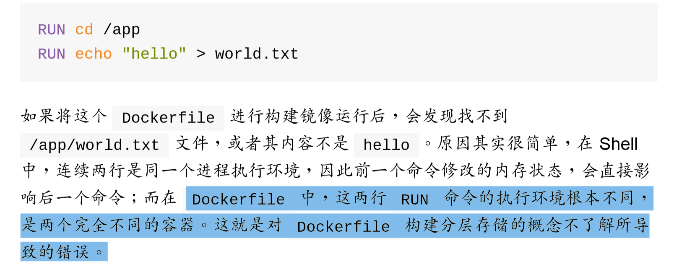

# 1. Dockerfile 指令详解

<!-- TOC -->

- [1. Dockerfile 指令详解](#1-dockerfile指令详解)
  - [1.1. FROM](#11-from)
  - [1.2. RUN](#12-run)
  - [1.3. CMD](#13-cmd)
  - [1.4. ENTRYPOINT](#14-entrypoint)
  - [1.5. EXPOSE](#15-expose)
  - [1.6. ADD](#16-add)
  - [1.7. COPY](#17-copy)
  - [1.8. ENV](#18-env)
  - [1.9. VOLUME](#19-volume)
  - [1.10. WORKDIR](#110-workdir)
  - [1.11. ONBUILD](#111-onbuild)
  - [1.12. USER](#112-user)
  - [1.13. MAINTAINER](#113-maintainer)
  - [1.14. dockerignore](#114-dockerignore)
  - [1.15. Dockerfile 示例](#115-dockerfile示例)
  - [1.16. jenkins 自动化](#116-jenkins-自动化)

<!-- /TOC -->

## 1.1. FROM

```dockerfile
FROM  <image>
或
FROM <image>:<tag>
```

在`Dockerfile`中第一条非注释`INSTRUCTION`一定是`FROM`，它决定了以哪一个镜像作为基准，`<image>`首选本地是否存在，如果不存在则会从公共仓库下载（当然也可以使用私有仓库的格式）。

## 1.2. RUN

```dockerfile
RUN <commnad>  (shell格式)
或
RUN ["executable", "param1", "param2"]  （数组/exec格式）
```

`RUN`指令会在当前镜像的顶层执行任何命令，并`commit`成新的（中间）镜像，提交的镜像会在后面继续用到。
上面看到`RUN`后的格式有两种写法。

1. `shell`格式，相当于执行 `/bin/sh -c "<command>"`:
   > RUN apt-get install vim -y
2. `exec`格式，不会触发`shell`，所以`$HOME`这样的环境变量无法使用，但它可以在没有`bash`的镜像中执行，而且可以避免错误的解析命令字符串：
   > RUN ["apt-get", "install", "vim", "-y"]  
   > RUN ["/bin/bash", "-c", "apt-get install vim -y"] (与 shell 风格相同)



## 1.3. CMD

```dockerfile
CMD ["executable","param1","param2"]  （数组/exec格式）
或
CMD command param1 param2  (shell格式)
```

一个`Dockerfile`里只能有一个`CMD`，如果有多个，只有最后一个生效。CMD 指令的主要功能是在 build 完成后，为了给`docker run`启动到容器时提供默认命令或参数，这些默认值可以包含可执行的命令，也可以只是参数（此时可执行命令就必须提前在 ENTRYPOINT 中指定）。

1. diff `RUN`

   > `RUN`是在`build`成镜像时就运行的，先于`CMD`和`ENTRYPOINT`的，`CMD`会在每次启动容器的时候运行，而`RUN`只在创建镜像时执行一次，固化在`image`中。

2. diff `ENTRYPOINT`
   > 区别在于如果`docker run`后面出现与`CMD`指定的相同命令，那么`CMD`会被覆盖；而`ENTRYPOINT`会把容器名后面的所有内容都当成参数传递给其指定的命令（不会对命令覆盖）。另外`CMD`还可以单独作为`ENTRYPOINT的`所接命令的可选参数。

## 1.4. ENTRYPOINT

```docker
ENTRYPOINT ["executable", "param1", "param2"]  （数组/exec格式，推荐）
或
ENTRYPOINT command param1 param2   (shell格式)
```

`ENTRYPOINT`命令设置在容器启动时执行命令，如果有多个`ENTRYPOINT`指令，那只有最后一个生效。有以下两种命令格式：

## 1.5. EXPOSE

```dockerfile
EXPOSE 11211
或
EXPOSE 11211 11212
```

`EXPOSE`指令告诉容器在运行时要监听的端口，但是这个端口是用于多个容器之间通信用的（links），外面的 host 是访问不到的。要把端口暴露给外面的主机，在启动容器时使用`-p 8080:11211`选项映射。

## 1.6. ADD

```dockerfile
ADD <src>,<src2>... <dest>
```

将文件`<src>`拷贝到`container`的文件系统对应的路径`<dest>`下。

1. `<src>`可以是文件、文件夹、URL，对于文件和文件夹`<src>`必须是在`Dockerfile`的相对路径下（build context path），即只能是相对路径且不能包含../path/。
2. `<dest>`只能是容器中的绝对路径。如果路径不存在则会自动级联创建，根据你的需要是`<dest>`里是否需要反斜杠/，习惯使用/结尾从而避免被当成文件。
3. `ADD`还支持自动解压`tar`文件，会先自动解压内容再 COPY 到在容器的/目录下。
4. `ADD`只有在`build`镜像的时候运行一次，后面运行`container`的时候不会再重新加载，也就是你不能在运行时通过这种方式向容器中传送文件，-v 选项映射本地到容器的目录。

## 1.7. COPY

```dockerfile
COPY <src>,<src2>... <dest>
或
COPY ["<src>","<src2>"... "<dest>"]
```

`COPY`的语法与功能与`ADD`相同，

1. diff ADD
   > 不支持上面讲到的`<src>`是远程`URL`、`自动解压`这两个特性
2. suggest
   > `Dockerfiles`建议尽量使用`COPY`，并使用`RUN`与`COPY`的组合来代替`ADD`，这是因为虽然`COPY`只支持本地文件拷贝到`container`，但它的处理比`ADD`更加透明，建议只在复制`tar`文件时使用`ADD`，如`ADD trusty-core-amd64.tar.gz` 。

## 1.8. ENV

```dockerfile
ENV <key> <value>
或
ENV <key=value> <key=value>
```

用于设置环境变量

1. 设置了后，后续的`RUN`命令都可以使用，当运行生成的镜像时这些环境变量依然有效，
2. 如果需要在运行时更改这些环境变量可以在运行`docker run`时添加`-env <key>=<value>`参数来修改。

## 1.9. VOLUME

```dockerfile
VOLUME /tmp
或
VOLUME ["/tmp", "/tmp2"]
```

`VOLUME`指令用来在容器中设置一个挂载点，可以用来让其他容器挂载以实现数据共享或对容器数据的备份、恢复或迁移。

1. 这里的`/tmp`目录就会在运行时自动挂载为匿名卷，任何向`/tmp`中写入的信息都不会记录进`容器存储层`，从而保证了容器存储层的`无状态化`。

## 1.10. WORKDIR

```dockerfile
WORKDIR /app
```

`WORKDIR`指令用于设置`Dockerfile`中的`RUN`、`CMD`和`ENTRYPOINT`指令执行命令的工作目录(默认为/目录)

## 1.11. ONBUILD

```dockerfile
ONBUILD ADD . /app/src
ONBUILD RUN /usr/local/bin/python-build --dir /app/src
```

`ONBUILD`指令用来设置一些触发的指令，用于在当该镜像被作为基础镜像来创建其他镜像时(也就是`Dockerfile`中的`FROM`为当前镜像时)执行一些操作，`ONBUILD`中定义的指令会在用于生成其他镜像的`Dockerfile`文件的`FROM`指令之后被执行，上述介绍的任何一个指令都可以用于`ONBUILD`指令，可以用来执行一些因为环境而变化的操作，使镜像更加通用。

1. `ONBUILD`中定义的指令在当前镜像的`build`中不会被执行。
2. `ONBUILD`指令不允许嵌套，例如`ONBUILD ONBUILD ADD . /data`是不允许的。
3. `ONBUILD`指令不会执行其定义的`FROM`或`MAINTAINER`指令。

## 1.12. USER

```dockerfile
USER daemon
```

为运行镜像时或者任何接下来的 RUN 指令指定运行用户名或 UID：

## 1.13. MAINTAINER

```dockerfile
MAINTAINER author's name mailaddress
```

使用`MAINTAINER`指令来为生成的镜像署名作者

## 1.14. dockerignore

The .dockerignore file
`.dockerignore`用来忽略上下文目录中包含的一些`image`用不到的文件，它们不会传送到`docker daemon`。规则使用`go`语言的匹配语法。

## 1.15. Dockerfile 示例

下面的`Dockerfile`是`MySQL`官方镜像的构建过程。从`ubuntu`基础镜像开始构建，安装`mysql-server`、配置权限、映射目录和端口，`CMD`在从这个镜像运行到容器时启动`mysql`。其中`VOLUME`定义的两个可挂载点，用于在`host`中挂载，因为数据库保存在主机上而非容器中才是比较安全的。

```dockerfile
# MySQL Dockerfile
#
# https://github.com/dockerfile/mysql
#

# Pull base image.
FROM dockerfile/ubuntu

# Install MySQL.
RUN \
  apt-get update && \
  DEBIAN_FRONTEND=noninteractive apt-get install -y mysql-server && \
  rm -rf /var/lib/apt/lists/* && \
  sed -i 's/^\(bind-address\s.*\)/# \1/' /etc/mysql/my.cnf && \
  sed -i 's/^\(log_error\s.*\)/# \1/' /etc/mysql/my.cnf && \
  echo "mysqld_safe &" > /tmp/config && \
  echo "mysqladmin --silent --wait=30 ping || exit 1" >> /tmp/config && \
  echo "mysql -e 'GRANT ALL PRIVILEGES ON *.* TO \"root\"@\"%\" WITH GRANT OPTION;'" >> /tmp/config && \
  bash /tmp/config && \
  rm -f /tmp/config

# Define mountable directories.
VOLUME ["/etc/mysql", "/var/lib/mysql"]

# Define working directory.
WORKDIR /data

# Define default command.
CMD ["mysqld_safe"]

# Expose ports.
EXPOSE 3306
```

---

```dockerfile
FROM golang:latest

# WORKDIR $GOPATH/src/zq-task/task/
# COPY . $GOPATH/src/zq-task/task/
WORKDIR /task/
COPY . /task/

RUN cp /usr/share/zoneinfo/Asia/Shanghai /etc/localtime

ENV GO111MODULE=on GOPROXY=https://goproxy.io,direct

RUN go build -o market-task .

# EXPOSE 8000

ENTRYPOINT ["./market-task"]
```

---

```dockerfile
# 使用官方Python运行时作为父映像
FROM python:3.6

# 将工作目录设置为 /app
WORKDIR /app

# 将当前目录内容复制到容器中 /app
COPY . /app

# 时间区域设置成东八区
#RUN apt-get install tzdata
RUN ln -sf /usr/share/zoneinfo/Asia/Shanghai /etc/localtime
RUN echo "Asia/Shanghai" > /etc/timezone
#RUN cat /etc/localtime
#RUN cat /etc/timezone

#RUN pip install --upgrade pip
#RUN pip freeze > requirements.txt
# 安装指定的任何所需包  requirements.txt
                    # pytz
                    # lxml
                    # requests
                    # xmltodict
                    # mongoengine
                    # apscheduler
                    # beautifulsoup4
RUN pip install --no-cache-dir -r ./requirements.txt -i http://mirrors.aliyun.com/pypi/simple/ --trusted-host mirrors.aliyun.com

# 在容器启动时运行 app.py
ENTRYPOINT ["python", "main.py"]
```

---

```xml
<properties>
    <docker.image.prefix>shujia</docker.image.prefix>
</properties>

...
<profile>
    <!-- 本地开发环境 -->
    <id>dev</id>
    <properties>
        <profiles.active>dev</profiles.active>
        <docker.tag>dev</docker.tag>
    </properties>
    <activation>
        <activeByDefault>true</activeByDefault>
    </activation>
</profile>
...
<plugin>
    <groupId>com.spotify</groupId>
    <artifactId>docker-maven-plugin</artifactId>
    <version>1.0.0</version>
    <configuration>
        <imageName>${docker.image.prefix}/${project.artifactId}:${docker.tag}</imageName>
        <dockerDirectory>src/main/docker</dockerDirectory>
        <resources>
            <resource>
                <targetPath>/</targetPath>
                <directory>${project.build.directory}</directory>
                <include>${project.build.finalName}.jar</include>
            </resource>
        </resources>
    </configuration>
</plugin>
```

```dockerfile
# spring boot 项目
FROM openjdk:8-jdk-alpine
VOLUME /tmp
#RUN echo "Asia/Shanghai" > /etc/timezone
#RUN ln -sf /usr/share/zoneinfo/Asia/Shanghai /etc/localtime
RUN apk --no-cache add tzdata
RUN ln -sf /usr/share/zoneinfo/Asia/Shanghai /etc/localtime
RUN echo "Asia/Shanghai" > /etc/timezone
ADD business-service-1.0.jar app.jar
ENTRYPOINT ["java","-Djava.security.egd=file:/dev/./urandom","-jar","/app.jar"]
```

## 1.16. jenkins 自动化

```shell
cd ${WORKSPACE}/

# replace text
#sed -i 's/oldText/newText/g' test.txt

# build docker image 方法1
mvn clean install
cd ${WORKSPACE}/business-service/
mvn clean package docker:build -Ptest

# build docker image 方法2
#docker build --tag image_name:test .


docker service create --name service_name -p 8092:8090 image_name:test

#docker service update --image image_name:test service_name

docker service scale service_name=0
docker service scale service_name=1

# clear none images
#docker rmi $(docker images | awk '/^<none>/ { print $3 }')
```

1. docker network create hadoop
