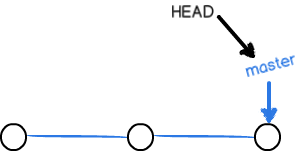
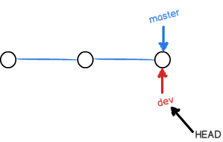
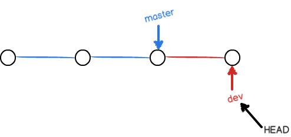
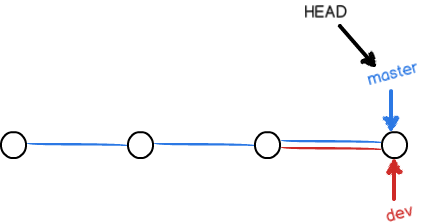
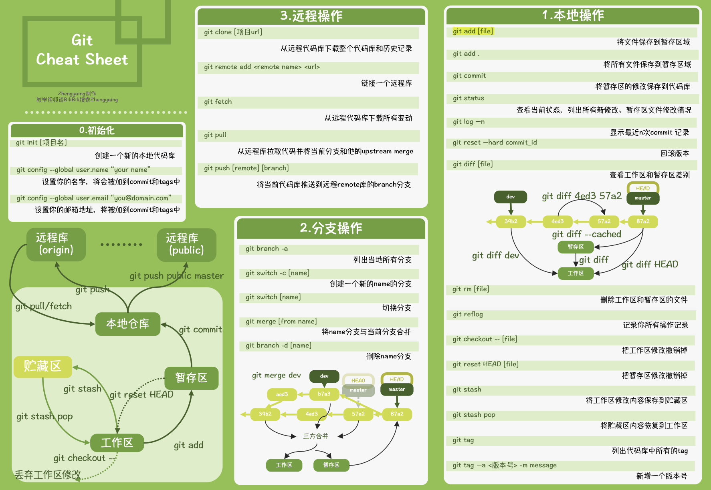

# 1. git 命令大全

<!-- TOC -->

- [1. git 命令大全](#1-git-命令大全)
  - [1.1. 须知概念](#11-须知概念)
  - [1.2. 全局配置](#12-全局配置)
  - [1.3. 帮助命令](#13-帮助命令)
  - [1.4. 查询命令](#14-查询命令)
  - [1.5. 跟踪和提交](#15-跟踪和提交)
  - [1.6. 文件比较](#16-文件比较)
  - [1.7. 文件回退](#17-文件回退)
  - [1.8. 版本回退](#18-版本回退)
  - [1.9. 远程库命令](#19-远程库命令)
  - [1.10. 分支命令](#110-分支命令)
  - [1.11. stash 命令](#111-stash命令)
  - [1.12. 标签命令](#112-标签命令)

<!-- /TOC -->

## 1.1. 须知概念

- git 是一条时间轴， 分支（master dev）指向提交时间点（commit id），HEAD 指向当前分支。
- git 分支切换指向
  - 切换到 master 分支：
  - 创建并切换到 dev 分支：
  - dev 修改提交（commit）:
  - 切换到 master，合并 dev：
- add 将工作区添加到 index(stage)中，用于下次提交； commit 将 index 中提交到 版本库中。
- git 结构（原仓库配图 `0.jpg` 缺失）
- pull 拉取远程库 push 推送到远程库。
- stash 保存工作现场(工作区)。

- 常用命令总览：

## 1.2. 全局配置

- git config --global credential.helper store
- git config --global color.ui true
- git config --global user.name "Your Name"
- git config --global user.email "email@example.com"
- git config --global alias.lg "log --color --graph --pretty=format:'%Cred%h%Creset -%C(yellow)%d%Creset %s %Cgreen(%cr) %C(bold blue)<%an>%Creset' --abbrev-commit"

- git config --list (查看配置)
- git config [--global] --unset credential.helper (重置配置)
- git credential-manager uninstall (清除用户名密码)

| config 路径         | 作用域       | 配置命令                      | 优先级 |
| ------------------- | ------------ | ----------------------------- | ------ |
| project/.git/config | project 项目 | git config (--local 缺省参数) | 高     |
| ~/.gitconfig        | 当前用户     | git config --global           | 中     |
| /etc/gitconfig      | 本机所有用户 | git config --system           | 低     |

## 1.3. 帮助命令

- git --help
- git help \<command>

## 1.4. 查询命令

| 命令                     | 参数    | 说明          |
| ------------------------ | ------- | ------------- |
| git init                 | 无      | 初始化        |
| git status               | 无      | 当前 git 状态 |
| git log --pretty=oneline | 无      | 日志信息      |
| git log --graph          | 无      | 分支合并图    |
| git reflog               | 无      | 命令历史记录  |
| git tag                  | 无      | 标签信息      |
| git show \<tagName>      | tagName | 标签详细信息  |

## 1.5. 跟踪和提交

| 命令                        | 参数        | 说明                   |
| --------------------------- | ----------- | ---------------------- |
| git add \<files>            | files       | 添加到暂存区(index)    |
| git commit -m "commit mark" | commit mark | 提交到版本库           |
| git rm --cached \<files>    | files       | 取消 git 追踪          |
| git rm \<files>             | files       | git 删除文件并取消追踪 |

```text
git rm [-f | --force] [-n] [-r] [--cached] [--ignore-unmatch] [--quiet] [--] <file>…​
-f
--force
    强力删除
-n
    不执行删除
-r
    递归删除
--cached
    只删除缓存中的（index/staged）,工作目录不改变（work tree）
```

## 1.6. 文件比较

| 命令                         | 参数 | 说明                  |
| ---------------------------- | ---- | --------------------- |
| git diff -- \<file>          | file | 工作区 与 暂存区 比较 |
| git diff --cached -- \<file> | file | 暂存区 和 版本库 比较 |
| git diff HEAD -- \<file>     | file | 工作区 和 版本库 比较 |

```text
git diff [<options>] [<commit>] [--] [<path>…​]
git diff [<options>] --cached [<commit>] [--] [<path>…​]
git diff [<options>] <commit> <commit> [--] [<path>…​]
git diff [<options>] <blob> <blob>
git diff [<options>] --no-index [--] <path> <path>
```

## 1.7. 文件回退

| 命令                    | 参数 | 说明                                                                |
| ----------------------- | ---- | ------------------------------------------------------------------- |
| git checkout -- \<file> | file | 取消工作区修改，回到暂存区                                          |
| git reset -- \<file>    | file | 取消暂存区修改(工作区不影响) ，回到版本库的,与`git add -- file`相反 |
| git clean -df           | 无   | 新增的文件（从工作目录中移除 untrack 文件.）                        |

- git reset [--soft (只重置 commit)|--mixed(默认，重置 index 和 commit)|--hard(工作区，index,commit 都重置)]
- git revert [-n(不自动提交)] （反向提交）

## 1.8. 版本回退

| 命令                          | 参数                  | 说明                                       |
| ----------------------------- | --------------------- | ------------------------------------------ |
| git reset --hard \<commit id> | commit id             | 版本库切换， 工作区 暂存区 版本库 全部替换 |
| git reset --hard HEAD^        | HEAD^ HEAD^^ HEAD-100 | 版本库切换 工作区 暂存区 版本库 全部替换   |

## 1.9. 远程库命令

格式

```shell
 git clone [-b branch-name] http://[userName:password@]ip.ip.ip.ip/project.git
```

| 命令                                                     | 参数        | 说明                             |
| -------------------------------------------------------- | ----------- | -------------------------------- |
| git remote add origin git@server-name:path/repo-name.git | origin url  | 关联 origin 远程仓库             |
| git push -u origin master                                | 无          | 第一次推送                       |
| git push                                                 | 无          | 后面推送                         |
| git clone git@server-name:path/repo-name.git             | 无          | clone 远程库， SSH 协议          |
| git clone https://github.com/....                        | 无          | clone 远程库， HTTP 协议         |
| git remote rm origin                                     | origin      | 删除 origin 远程库连接           |
| git remote -v                                            | 无          | 查看远程库信息                   |
| git branch --set-upstream branch-name origin/branch-name | branch-name | 本地分支和远程分支创建链接关系   |
| git push --force origin \<branch-name>                   | branch-name | 强制推送                         |
| git fetch                                                | 无          | 修改 本地远程库记录 的 commit id |
| git pull                                                 | 无          | 修改 本地版本库 的 commit id     |

## 1.10. 分支命令

| 命令                                            | 参数 | 说明                                      |
| ----------------------------------------------- | ---- | ----------------------------------------- |
| git branch                                      | 无   | 查看分支                                  |
| git branch \<name>                              | name | 创建分支                                  |
| git branch -d \<name>                           | name | 删除分支                                  |
| git branch -D \<name>                           | name | 强制删除分支                              |
| git -dr \<origin/name> git push origin :\<name> | name | 删除远程分支（2 step）                    |
| git push origin -d \<name>                      | name | 删除远程分支                              |
| git checkout \<name>                            | name | 切换分支                                  |
| git checkout -b \<name>                         | name | 创建+切换分支                             |
| git checkout -b \<name> origin/\<name>          | name | 创建+切换分支+远程对应分支链接关系创建    |
| git merge \<name>                               | name | 将 name 分支合并到当前分支                |
| git merge --no-ff -m 'commit mark' \<name>      | name | `--no-ff`指的是强行关闭`fast-forward`方式 |
| git merge --squash \<name>                      | name | 将**name 分支**多次`commit`历史压缩为一次 |

- 总结：
  > `fast-forward：`是当条件允许的时候，`git`直接**移动`HEAD`指针**指向**name 分支**的头，完成合并.不过这种情况如果删除分支，则会丢失分支信息。因为在这个过程中没有创建`commit`  
  > **移动`HEAD`** || **自动创建新的`commit`**

---

> `--no-ff：`不使用`fast-forward`方式合并，保留**name 分支**的`commit`历史  
> **不移动`HEAD`** && **自动创建新的`commit`**

---

> `--squash：`使用`squash`方式合并，是用来把一些不必要`commit`进行压缩  
> **不移动`HEAD`** && **手动创建新的`commit`**

- 注：解决冲突后， 先 `git add \<conflict files>`, 再 `git commit -m 'conflict fixed'`

## 1.11. stash 命令

| 命令            | 参数 | 说明                          |
| --------------- | ---- | ----------------------------- |
| git stash       | 无   | 暂存工作现场                  |
| git stash list  | 无   | 查看                          |
| git stash apply | 无   | 恢复，并不删除 stash          |
| git stash drop  | 无   | 删除                          |
| git stash pop   | 无   | 恢复的同时把 stash 内容也删了 |

## 1.12. 标签命令

| 命令                   | 参数 | 说明          |
| ---------------------- | ---- | ------------- |
| git tag [-l \| --list] | 无   | 查看 tag list |
| git tag \<name>        | name | 创建 tag      |
| git tag -d \<name>     | name | 删除 tag      |

## 1.13. 远程操作

```shell
git fetch

git pull

git push

```
