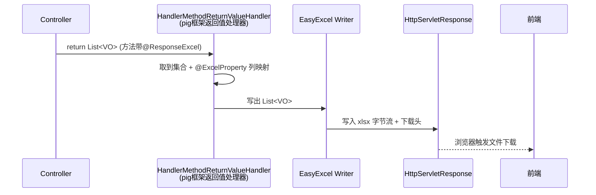
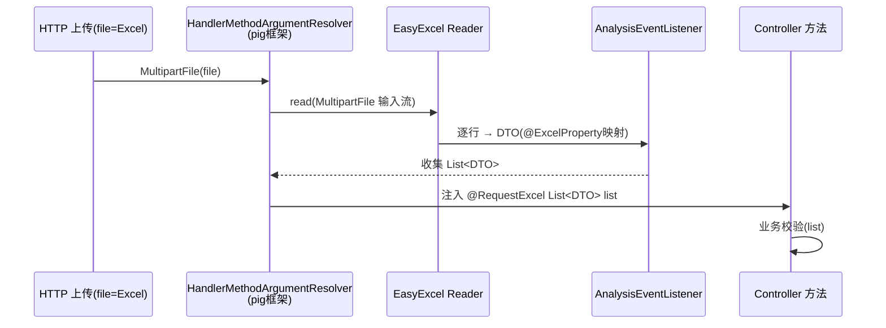

# Excel 导入导出（`@ResponseExcel` / `@RequestExcel`）与字典翻译说明

> 本文分三部分：① 导出注解 `@ResponseExcel` 原理；② 导入注解 `@RequestExcel` 原理；③ 本仓「字典翻译」实现（基于 EasyExcel `Converter`）。
> 关键边界：注解来自 **pig 微服务框架**（`com.pig4cloud.plugin.excel`，模块 `pig-common-excel`），由 `com.chery.apollo.framework` 间接引入。**本仓库只消费、不持有源码**，本地 `.m2` 也无该 JAR 可反编译，故原理基于 pig 开源标准实现 + 本仓实际用法描述；本仓确证的事实是「使用方式」（见第 4 节清单）。
> 版本提示：pig 4.x 已将该模块包名从 `com.pig4cloud.plugin.excel` 改名为 `com.pig4cloud.pig.common.excel`（并拆出 `aop/config/converters` 等子包）；本仓库 import 的仍是旧包，说明跑在 **pig 旧版本**，下列类名以「框架内部类」统称，避免凭记忆写死具体类名（本环境无 JAR 可反编译确证）。

## 1. 整体关系

```mermaid
graph LR
    subgraph 本仓代码[biz 业务代码]
        CT[Controller 方法]
        DTO[导入/导出 DTO<br/>@ExcelProperty 标注列]
        CONV[Converter 实现<br/>字典翻译]
    end
    subgraph pig框架[pig-common-excel 框架]
        RE[@ResponseExcel 注解]
        RQ[@RequestExcel 注解]
        ADV[HandlerMethodReturnValueHandler<br/>返回值处理器]
        RES[HandlerMethodArgumentResolver<br/>参数解析器]
        LIST[AnalysisEventListener 读监听]
    end
    CT -- 标注 --> RE
    CT -- 标注 --> RQ
    RE --> ADV
    RQ --> RES
    ADV --> DTO
    RES --> LIST --> DTO
    DTO --> CONV
```

## 2. `@ResponseExcel` 导出原理

**作用**：把一个 `List<VO>` 直接写出成 Excel 文件，通过 HTTP 响应下载，不走正常 JSON 序列化。

**框架实现（pig 标准）**：
- 注解 `@ResponseExcel` 可配 `name`（文件名，不带后缀，框架自动拼 `.xlsx`）、`sheetName`、`password`、`template` 等。
- 框架注册一个 `HandlerMethodReturnValueHandler`（Spring 的返回值处理器，注意：**不是** `ResponseBodyAdvice`）。Spring 在选好 Controller 返回值如何写响应时，会遍历已注册的返回值处理器，命中 `@ResponseExcel` 的方法就交给它处理：
  - `supportsReturnType()`：判断目标方法是否带 `@ResponseExcel` 注解；
  - `handleReturnValue()`：命中后拦截，从返回值里取集合（本仓都是 `List<VO>`），用 **EasyExcel** 的 `ExcelWriter` 把集合按 DTO 上的 `@ExcelProperty` 列定义写出，**直接写入 `HttpServletResponse` 的输出流**，并设置响应头：
    - `Content-Type: application/vnd.openxmlformats-officedocument.spreadsheetml.sheet`
    - `Content-Disposition: attachment; filename=xxx.xlsx`（中文名做 URL 编码）
  - 因为响应流已被 Excel 占满，正常 JSON 序列化被短路，前端拿到的是文件下载。
  - 该框架内部类的真实类名本环境无法反编译确证（旧包 `com.pig4cloud.plugin.excel` 下常见的命名如 `ExcelHandlerAdvice`/`ExcelResponseAdvice`，但请勿当作结论）。



**本仓用法要点**：
- 导出方法直接返回 `List<XxxVO>`，**不要**用 `R<>` 包（否则框架取不到集合，会被当普通 JSON）。例如 `AdminTestDriveController.exportAppoint` 返回 `List<AppointOrderExportVO>`。
- 列定义、顺序、宽度全部写在 VO 的 `@ExcelProperty(value="中文列名", index=N)` + `@ColumnWidth` 上。
- 需要「字典翻译」的列，在 `@ExcelProperty` 上加 `converter=xxxConverter.class`（见第 3 节）。

## 3. `@RequestExcel` 导入原理

**作用**：把上传的 Excel 文件直接解析成 `List<DTO>`，注入到 Controller 方法参数里，省去手写流读取/解析。

**框架实现（pig 标准）**：
- 注解 `@RequestExcel` 可配 `fileName`（上传文件表单字段名，默认 `"file"`）。
- 框架注册 `HandlerMethodArgumentResolver`（参数解析器，旧包下常见命名如 `RequestExcelArgumentResolver`，本文不写死）。Spring 在调用 Controller 方法前解析每个形参时：
  - `supportsParameter()`：形参带 `@RequestExcel` 注解；
  - `resolveArgument()`：从请求取 `MultipartFile`（按 `fileName`），用 **EasyExcel** 的 `read()` + 自定义 `AnalysisEventListener`（pig 里含 JSR-303 校验收集，校验失败抛异常/收集到错误模型），把每行映射成 DTO（按 `@ExcelProperty` 列序/列名），最终得到 `List<DTO>` 注入形参。



**本仓用法要点**：
- 形参写法：`public R<XxxCheckDTO> importCheck(@RequestExcel List<KocUserImportDTO> list)`（默认读 `file` 字段）。
- 显式指定文件名：`@RequestExcel(fileName = "file") List<DeliveryStatusTemplateDto> list`。
- 解析只是「把行变成对象」，业务合法性校验（空行过滤、重复、落库）在方法体内自己做（如 `KocUserController.importCheck` 先 `filter` 空行再调 `kocUserService.importCheck`）。
- 通常配合「下载模板」接口（`@ResponseExcel` 返回空 `List<导入DTO>`）让前端拿到表头。

## 4. 本仓使用清单

### 4.1 `@ResponseExcel`（导出，共 6 处）

| 位置 | 接口 | 文件名 `name` | 返回 |
| --- | --- | --- | --- |
| `KocUserController:39` | `POST /koc/user/template` 下载模板 | KOC导入模版 | `List<KocUserImportDTO>` |
| `KocUserController:93` | `GET /koc/user/export` 导出 | KOC用户导出 | `List<KocUserDTO>` |
| `AdminTestDriveController:129` | `POST /admin/test/drive/exportAppoint` 导出试驾单 | （未命名，默认） | `List<AppointOrderExportVO>` |
| `AdminInviteCarRewardController:60` | 购车试驾记录导出 | 购车试驾记录导出 | `List<...>` |
| `AdminInviteCouponController:104` | 发放人群模板 | 发放人群模板 | `List<...>` |
| `AdminInviteDataController:108` | 批量调整购车奖励状态模板 | 批量调整购车奖励状态模板 | `List<...>` |

### 4.2 `@RequestExcel`（导入，共 2 处）

| 位置 | 接口 | 文件字段 |
| --- | --- | --- |
| `KocUserController:51` | `POST /koc/user/import/check` 导入校验 | 默认 `file` |
| `AdminInviteDataController:121` | 导入校验 | `fileName = "file"` |

## 5. 字典翻译（本仓实现）

**结论：本仓「字典翻译」= Excel 导出时把枚举 `code` 翻译成中文描述，通过 EasyExcel 的 `Converter` 接口实现，不是框架级远程字典。**

全仓 grep `DictResolver` / `@ExcelDict` 等框架字典 API **无命中**；响应里的 `translation` 字段（见 `appointDetail` 响应）是接口的国际化翻译标记，与 Excel 字典翻译是两回事。本仓的 Excel 翻译是**本地枚举 converter** 方案。

### 5.1 原理

EasyExcel 写入单元格时，对带 `converter` 的字段会回调 `Converter.convertToExcelData(value, ...)`：
- 自定义类实现 `com.alibaba.excel.converters.Converter<T>`；
- `supportJavaTypeKey()`：字段 Java 类型；
- `supportExcelTypeKey()`：Excel 单元格类型（本仓统一 `STRING`）；
- `convertToExcelData(value, ...)`：根据 `value`（枚举 code）遍历枚举找到对应项，返回 `WriteCellData<>(枚举的中文描述)`；找不到则返回原值（兜底）。

```mermaid
flowchart LR
    VO字段[VO 字段 code=2] -->|@ExcelProperty converter=XxxConverter| C[Converter.convertToExcelData]
    C -->|遍历枚举匹配 code| E[枚举.comment 中文]
    E -->|WriteCellData| Cell[Excel 单元格显示中文]
```

### 5.2 本仓示例（`KocUserDTO`）

导出 DTO 在字段上声明：
```java
@ExcelProperty(converter = KocUserAuditStatusEnumConverter.class, value = "审核状态", index = 13)
private String auditStatus;   // 存的是 code，如 "2"

@ExcelProperty(converter = FansCountEnumConverter.class, value = "粉丝数", index = 6)
private Integer fansCount;

@ExcelProperty(converter = YesOrNoEnumConverter.class, value = "是否愿意参加", index = 12)
private Integer participateFlag;
```

Converter 模板（以 `KocUserAuditStatusEnumConverter` 为例）：
```java
public class KocUserAuditStatusEnumConverter implements Converter<String> {
    @Override public Class<?> supportJavaTypeKey() { return String.class; }
    @Override public CellDataTypeEnum supportExcelTypeKey() { return CellDataTypeEnum.STRING; }
    @Override
    public WriteCellData<?> convertToExcelData(String value, ExcelContentProperty p, GlobalConfiguration g) {
        for (KocUserAuditStatusEnum e : KocUserAuditStatusEnum.values()) {
            if (String.valueOf(e.getCode()).equals(value)) {
                return new WriteCellData<>(e.getComment());   // code -> 中文描述
            }
        }
        return new WriteCellData<>(String.valueOf(value));    // 兜底：原值
    }
}
```
翻译依赖枚举本身带 `code` + `comment`（中文）两个字段（如 `KocUserAuditStatusEnum`：1 待审核 / 2 已通过 / 3 已驳回 / 4 取消认证）。

### 5.3 适用范围与局限

- **单向翻译**：本仓 converter 只实现 `convertToExcelData`（导出 code→中文）。导入反向（中文→code）需实现 `convertToJavaData`，导入 DTO 一般直接映射中文列、由业务层处理，未走反向 converter。
- **每个翻译字段一个 Converter 类**：本仓 koc 域有 `KocUserAuditStatusEnumConverter` / `FansCountEnumConverter` / `YesOrNoEnumConverter` 三个，均在 `biz/koc/convert/` 下，结构一致。
- **兜底策略**：找不到匹配的 code 时返回原始值，避免导出出现空单元格。
- 注：`FansCountEnumConverter` 实现 `Converter<Integer>` 但 `supportJavaTypeKey()` 返回 `String.class`，存在类型标注不一致；字段 `fansCount` 实际为 `Integer`，若后续升级 EasyExcel 版本需核对解析行为。

> 补充：仓库 `target/doc/dict.html` 是 **springdoc（Swagger）生成的 API 文档页**里的字典描述，与上文 Excel 字典翻译无直接关系，勿混淆。

## 6. 小结

| 主题 | 原理归属 | 本仓职责 |
| --- | --- | --- |
| `@ResponseExcel` 导出 | pig 框架 `HandlerMethodReturnValueHandler` + EasyExcel | 提供 `List<VO>` + `@ExcelProperty` 列定义 |
| `@RequestExcel` 导入 | pig 框架 `HandlerMethodArgumentResolver` + EasyExcel 监听 | 提供 `List<DTO>` 形参 + 方法内业务校验 |
| 字典翻译 | EasyExcel `Converter` 接口（本仓自写） | 枚举 code→中文，写 `XxxConverter` 绑到 VO 字段 |

易错点：
- 导出方法务必返回 `List`，**别用 `R<>` 包**，否则框架取不到集合会被当 JSON 返回。
- 导入校验分两层：框架只负责「文件→List」，业务合法性在方法体内做。
- 列顺序/中文名/宽度全在 `@ExcelProperty(index=...)` + `@ColumnWidth` 上，改名改这里。
