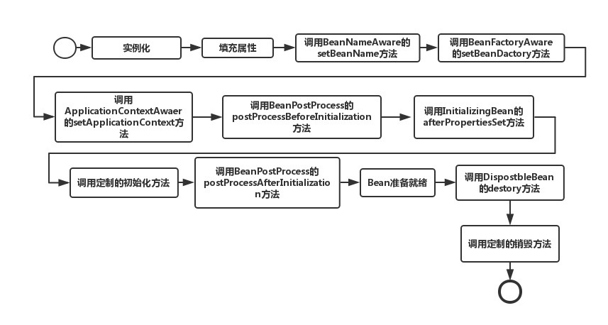

## bean 生命周期



```java

@Configuration
public class BeanLifeCycleConfig {

    private final static Logger logger = LoggerFactory.getLogger(BeanLifeCycle.class);

    @Bean(initMethod = "initMethod", destroyMethod = "destroyMethod")
    BeanLifeCycle customBean() {
        return new BeanLifeCycle();
    }

    @Bean
    BeanPostProcessor customBeanPostProcessor() {
        return new BeanPostProcessor() {
            @Override//4
            public Object postProcessBeforeInitialization(Object bean, String beanName) throws BeansException {
                if (bean instanceof BeanLifeCycle) {
                    logger.info("postProcessBeforeInitialization-BeanPostProcessor");
                }
                return bean;
            }

            @Override//8
            public Object postProcessAfterInitialization(Object bean, String beanName) throws BeansException {
                if (bean instanceof BeanLifeCycle) {
                    logger.info("postProcessAfterInitialization-BeanPostProcessor");
                }
                return bean;
            }
        };
    }

    static class BeanLifeCycle implements BeanNameAware, BeanFactoryAware, ApplicationContextAware,
            InitializingBean, DisposableBean {

        @Override//1
        public void setBeanName(String name) {
            logger.info("setBeanName-BeanNameAware");
        }
        @Override//2
        public void setBeanFactory(BeanFactory beanFactory) throws BeansException {
            logger.info("setBeanFactory-BeanFactoryAware");
        }
        @Override //3
        public void setApplicationContext(ApplicationContext applicationContext) throws BeansException {
            logger.info("ApplicationContextAware-ApplicationContextAware");
        }

        // 4 postProcessBeforeInitialization-BeanPostProcessor

        @PostConstruct//5
        public void postConstruct() {
            logger.info("postConstruct-AnnotationBean");
        }
        @Override//6
        public void afterPropertiesSet() throws Exception {
            logger.info("afterPropertiesSet-InitializingBean");
        }
        //7
        public void initMethod() {
            logger.info("init-method");
        }

        //8 postProcessAfterInitialization-BeanPostProcessor

        @PreDestroy//9
        public void preDestroy() {
            logger.info("preDestroy-AnnotationBean");
        }
        @Override//10
        public void destroy() throws Exception {
            logger.info("destroy-DisposableBean");
        }
        //11
        public void destroyMethod() {
            logger.info("destroy-method");
        }
    }
}

2021-03-04 09:40:25.976  INFO 54628 --- [           main] .w.o.u.BeanLifeCycleConfig$BeanLifeCycle : setBeanName-BeanNameAware
2021-03-04 09:40:26.895  INFO 54628 --- [           main] .w.o.u.BeanLifeCycleConfig$BeanLifeCycle : setBeanFactory-BeanFactoryAware
2021-03-04 09:40:28.102  INFO 54628 --- [           main] .w.o.u.BeanLifeCycleConfig$BeanLifeCycle : ApplicationContextAware-ApplicationContextAware
2021-03-04 09:40:36.459  INFO 54628 --- [           main] .w.o.u.BeanLifeCycleConfig$BeanLifeCycle : postProcessBeforeInitialization-BeanPostProcessor
2021-03-04 09:40:43.033  INFO 54628 --- [           main] .w.o.u.BeanLifeCycleConfig$BeanLifeCycle : postConstruct-AnnotationBean
2021-03-04 09:40:50.358  INFO 54628 --- [           main] .w.o.u.BeanLifeCycleConfig$BeanLifeCycle : afterPropertiesSet-InitializingBean
2021-03-04 09:40:54.551  INFO 54628 --- [           main] .w.o.u.BeanLifeCycleConfig$BeanLifeCycle : init-method
2021-03-04 09:40:59.614  INFO 54628 --- [           main] .w.o.u.BeanLifeCycleConfig$BeanLifeCycle : postProcessAfterInitialization-BeanPostProcessor
2021-03-04 09:41:18.195  INFO 54628 --- [extShutdownHook] .w.o.u.BeanLifeCycleConfig$BeanLifeCycle : preDestroy-AnnotationBean
2021-03-04 09:41:18.196  INFO 54628 --- [extShutdownHook] .w.o.u.BeanLifeCycleConfig$BeanLifeCycle : destroy-DisposableBean
2021-03-04 09:41:18.196  INFO 54628 --- [extShutdownHook] .w.o.u.BeanLifeCycleConfig$BeanLifeCycle : destroy-method
```

FactoryBean 是 Spring IOC 的两大扩展之一(另一个是 BeanPostProcessor)
AbstractBeanFactory 中对 FactoryBean 处理的代码

```java
// AbstractBeanFactory 中对 FactoryBean 处理的代码
if (mbd.isSingleton()) {
 sharedInstance = getSingleton(beanName, () -> {
		try {
			return createBean(beanName, mbd, args);
		}
		catch (BeansException ex) {
			// Explicitly remove instance from singleton cache: It might have been put there
			// eagerly by the creation process, to allow for circular reference resolution.
			// Also remove any beans that received a temporary reference to the bean.
			destroySingleton(beanName);
			throw ex;
		}
	});
	// 处理FactoryBean扩展
	bean = getObjectForBeanInstance(sharedInstance, name, beanName, mbd); //Object object = doGetObjectFromFactoryBean(factory, beanName);
}
```

## ObjectProvider

更加宽泛的依赖注入

```java

public interface ObjectProvider<T> extends ObjectFactory<T>, Iterable<T> {

	T getObject(Object... args) throws BeansException;

	@Nullable
	T getIfAvailable() throws BeansException;

    ...
}
//  使用示例1
  public MybatisAutoConfiguration(MybatisProperties properties, ObjectProvider<Interceptor[]> interceptorsProvider,
      ObjectProvider<TypeHandler[]> typeHandlersProvider, ObjectProvider<LanguageDriver[]> languageDriversProvider,
      ResourceLoader resourceLoader, ObjectProvider<DatabaseIdProvider> databaseIdProvider,
      ObjectProvider<List<ConfigurationCustomizer>> configurationCustomizersProvider) {
    this.properties = properties;
    this.interceptors = interceptorsProvider.getIfAvailable();
    this.typeHandlers = typeHandlersProvider.getIfAvailable();
    this.languageDrivers = languageDriversProvider.getIfAvailable();
    this.resourceLoader = resourceLoader;
    this.databaseIdProvider = databaseIdProvider.getIfAvailable();
    this.configurationCustomizers = configurationCustomizersProvider.getIfAvailable();
  }

//  使用示例2
@Service
public class FooService {
    private FooRepository fooRepository;
    public FooService(ObjectProvider<FooRepository> fooRepositoryObjectProvider){
        this.fooRepository=fooRepositoryObjectProvider.getIfAvailable();
    }
}
```

## Spring 配置类的 Full 模式和 Lite 模式

### Lite 模式

官方定义为：在没有标注@Configuration 的类里面有@Bean 方法就称为 Lite 模式的配置类。
透过源码再看这个定义是不完全正确的，而应该是如下 case 均认为是 Lite 模式的配置类。

类上没有标注@Configuration，但有@Component、@ComponentScan、@Import、@ImportResource；
类上没有注解，但类内方法存在@Bean 注解。

在 Spring 5.2 之后，新增了一种 case 也算作 Lite 模式：
标注有@Configuration(proxyBeanMethods = false)的类，注意：此值默认是 true。

自 Spring 5.2（对应 Spring Boot 2.2.0）开始，内置的几乎所有的@Configuration 配置类都被修改为了@Configuration(proxyBeanMethods = false)，目的是：降低启动时间，为 Cloud Native 做准备。

### Lite 模式优缺点

优点：

运行时不再需要给对应类生成 CGLIB 子类，放进 IoC 容器内的就是本尊，提高了运行性能，降低了启动时间；
不用生成代理意味着该配置类可以是 private、final 的。

缺点：

不能通过方法调用来依赖其它 Bean，即不能通过方法调用声明@Bean 之间的依赖（可以通过作为入参规避）。

## Full 模式优缺点

```java
public @interface Configuration {}
public class ConfigurationClassPostProcessor implements BeanDefinitionRegistryPostProcessor{

    public void enhanceConfigurationClasses(ConfigurableListableBeanFactory beanFactory) {
        ...
		ConfigurationClassEnhancer enhancer = new ConfigurationClassEnhancer(); // public class MethodProxy {}
        ...
    }
}
public interface BeanDefinitionRegistryPostProcessor extends BeanFactoryPostProcessor {}
```

优点：

Full 模式下，交叉方法引用会被重定向到容器的生命周期管理，可以方便地管理 Bean 依赖。

缺点参照 Lite 模式的优点。
关于“通过方法调用声明 Bean 之间的依赖”例子
如下，transactionManager 通过 dateSource()声明了它依赖 dataSource。
而且 **dateSource()方法只会被调用一次。**

```java
@Configuration
public class DataSourceConfig {

    ...
    @Bean
    public DataSource dataSource() {
        ...
        return dataSource;
    }
    @Bean(name = "transactionManager")
    public DataSourceTransactionManager transactionManager() {
        return new DataSourceTransactionManager(dataSource());
    }
    ...
}
```
